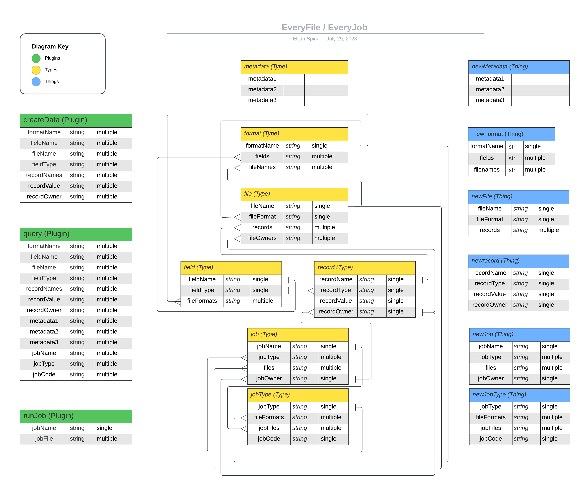

🚧 **_Under active development. Please use wisely._** 🚧

---

# Hyperfiles

Organize everything. Hyperfiles is a self-organizing universal knowledge graph.

**Quick Start**
1. [Create a new fileformat](https://everything.dev/flowscience.near/widget/create.fileFormat) (schema)
2. [Create a new file](https://everything.dev/flowscience.near/widget/create.file) (attestation)

**Guides and Example Use Cases** (in progress)
- Guide: ["How to Create a New Fileformat"] - coming soon!
- Guide: ["How to Create a New File"] - coming soon!
- Guide: ["How to Use Attestations"] - coming soon!
- Use Case: ["Near Attestation Service"](https://near.social/flowscience.near/widget/NAS) - in progress!
- Use Case: ["Hypercerts on BOS" - demo](https://near.social/flowscience.near/widget/hypercert.page) ~ [Docs](https://github.com/open-cann/hypercerts-on-bos)
- Use Case: ["Scientific Fileformat Ontology (SFO)"] - coming soon!
- Guide: ["Hyperfiles Development Roadmap"] - coming soon!

---

### Standardized Type Schema
- The Hyperfiles knowledge graph is composed by reducing any piece of data or code into a set of unique objects, called `records`, which map to a set of pre-defined `fields`.
- Each set of `fields` composes into a unique `fileformat`. Likewise, each set of `records` composes into a unique `file`.
- `Files` are an indexed combination of `fields` and `records`.
- `Jobs` are a specific `fileformat` type that contain a set of instructions to run a Docker container using decentralized compute networks.

### Self-Assembling Data Structures
These features will be developed after a front-end that enables users to manually interact with the knowledge graph.

- [ ] Any data or job can be mixed and matched, enabling seamless composability across apps.
- [ ] Fileformats are automatically detected & categorized when new data is entered or when new fileformats are created during queries and jobs.
- [ ] Fields are analyzed to identify primitive types and basic statistics
- [ ] Core types & user-specific types?
- [ ] Marketplace price determination

---

### Components

**Integrated Frontend** - [In Progress](https://github.com/flowscience/hyperfiles/tree/master/widgets/plugins/hyperfiles.jsx)
- [ ] Publish (file/fileformat) - coming soon!
- [ ] Explore - coming soon!
- [ ] Profile - coming soon!

**Top-Level Plugins**: These are the main components used to interact with the entire Hyperfiles knowledge graph.
- `newFile`: create a new file via upload, manual input, and queries - [MVP Complete!](https://everything.dev/flowscience.near/widget/create.file)
- `query`: find any set of things, then mix and match - coming soon!
- `newJob`: create a new job file and execute a tool config - coming soon!

**Mid-Level Plugins**: These components can be used by developers to create new use cases for Hyperfiles.
- `create.fileformat`: create a new fileformat thing (should fileformats have owners?) - [MVP Complete!](https://everything.dev/flowscience.near/widget/create.fileFormat)
- `create.record`: create a new record thing - [MVP Complete!](https://everything.dev/flowscience.near/widget/create.record)

**Backend Plugins**: These component(s) are used by the top-level and mid-level plugins and likely won't need to be modified when integrating or using Hyperfiles.
- `create.field`: create a new field thing - [MVP Complete!](https://everything.dev/flowscience.near/widget/create.field)

**Core Types**
1. [field](https://github.com/flowscience/hyperfiles/blob/master/types/core_types/field.json)
2. [record](https://github.com/flowscience/hyperfiles/blob/master/types/core_types/record.json)
3. [fileformat](https://github.com/flowscience/hyperfiles/blob/master/types/core_types/fileformat.json)
4. [file](https://github.com/flowscience/hyperfiles/blob/master/types/core_types/file.json)
5. [metadata](https://github.com/flowscience/hyperfiles/blob/master/types/core_types/metadata.json) - needs update!

---

**To Do**
- [ ] Enable upload if file matches a template. Otherwise, use input fields.
- [ ] Fileformat by creating an array of fields and checking if fields exist, then check if that combination of fields exists
- [ ] Create unique IDs for each unique Thing (start with core types)
- [ ] create.field (xN) → create.fileFormat (x0-1) → create.record (xN) → create.file (x1)
- [ ] Enable using queries to create new files
- [ ] Index [EAS](https://attest.sh/) & enable cross-minting

---

🧬 Built by [flowscience](https://github.com/flowscience).  [No rights reserved](https://github.com/flowscience/hyperfiles/blob/master/LICENSE).

---
